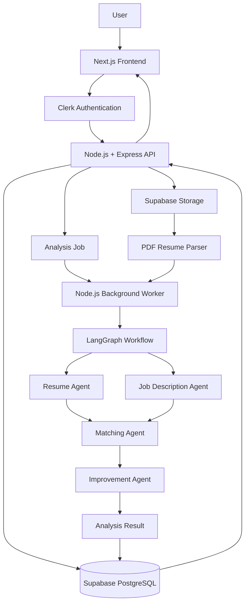

# ResumeAgent

ResumeAgent is a full-stack **AI-powered multi-agent resume intelligence platform** that analyzes resumes against job descriptions, calculates job compatibility, identifies skill gaps, and generates personalized resume improvement suggestions.

Instead of producing a generic ATS score, ResumeAgent evaluates a resume **for a specific job role** using specialized AI agents orchestrated through LangGraph.

---

## Features

- Secure authentication with Clerk
- Upload and manage PDF resumes
- Resume text extraction and structured parsing
- Job description analysis
- Resume-to-job compatibility scoring
- Matched skill detection
- Missing skill detection
- ATS keyword analysis
- Weak resume section detection
- Job-specific resume improvement suggestions
- AI-generated recommendations based only on existing experience
- Multi-agent AI workflow
- Asynchronous resume analysis
- Analysis history dashboard
- Retry handling for failed AI workflows
- Structured API validation
- Secure file storage
- Centralized backend error handling
- Structured application logging

---

## Multi-Agent System

ResumeAgent uses four specialized AI agents.

### Resume Agent

Extracts structured information from the uploaded resume.

```text
Resume
  ↓
Skills
Experience
Projects
Education
Technologies
Achievements
```

---

### Job Description Agent

Analyzes the target job description and extracts:

```text
Required Skills
Preferred Skills
Responsibilities
Keywords
Technologies
Experience Requirements
```

---

### Matching Agent

Compares the structured resume with the analyzed job description.

Produces:

```text
Overall Match Score

Matched Skills
Missing Skills
Weakly Represented Skills
Keyword Match
Experience Relevance
Project Relevance
```

---

### Improvement Agent

Uses the matching results to generate actionable resume improvements.

It can suggest:

- skills to highlight
- bullets to rewrite
- important keywords to include
- relevant projects to emphasize
- weak sections to improve

The agent is instructed to **never invent skills, achievements, experience, companies, or numerical metrics that are not supported by the original resume**.

---

# Architecture



---

# Analysis Workflow

```text
User
 │
 ├── Upload Resume
 │
 └── Paste Job Description
          │
          ▼
      Express API
          │
          ▼
   Store Resume Metadata
          │
          ▼
   Supabase Storage
          │
          ▼
     Extract PDF Text
          │
          ▼
   Create Analysis Job
          │
          ▼
    Background Worker
          │
          ▼
      LangGraph
          │
     ┌────┴────┐
     ▼         ▼
 Resume      JD Agent
 Agent
     └────┬────┘
          ▼
    Matching Agent
          │
          ▼
  Improvement Agent
          │
          ▼
   Store Final Result
          │
          ▼
      Dashboard
```

---

# Tech Stack

## Frontend

- Next.js
- TypeScript
- Tailwind CSS
- shadcn/ui

## Backend

- Node.js
- Express.js
- TypeScript

## Authentication

- Clerk

## Database

- PostgreSQL
- Supabase
- Drizzle ORM

## File Storage

- Supabase Storage

## AI

- Groq LLM
- LangGraph.js

## Validation

- Zod

## Logging

- Pino

## Resume Processing

- PDF parsing
- Structured resume extraction

## Deployment

- Vercel — frontend
- Render — backend
- Supabase — PostgreSQL and file storage

---

# Project Structure

```text
resume-agent/
│
├── apps/
│   │
│   ├── web/
│   │   ├── app/
│   │   │   ├── analyze/
│   │   │   ├── dashboard/
│   │   │   ├── how-it-works/
│   │   │   └── page.tsx
│   │   │
│   │   ├── components/
│   │   ├── lib/
│   │   └── package.json
│   │
│   └── api/
│       │
│       ├── src/
│       │   ├── config/
│       │   ├── middleware/
│       │   ├── db/
│       │   │
│       │   ├── modules/
│       │   │   ├── health/
│       │   │   ├── resume/
│       │   │   ├── job/
│       │   │   └── analysis/
│       │   │
│       │   ├── agents/
│       │   │   ├── resume.agent.ts
│       │   │   ├── job.agent.ts
│       │   │   ├── matching.agent.ts
│       │   │   └── improvement.agent.ts
│       │   │
│       │   ├── workflows/
│       │   ├── workers/
│       │   ├── routes/
│       │   ├── app.ts
│       │   └── server.ts
│       │
│       └── package.json
│
└── README.md
```

---

# Backend Architecture

Each backend feature follows a simple layered architecture:

```text
HTTP Request
     ↓
Route
     ↓
Controller
     ↓
Service
     ↓
Drizzle ORM
     ↓
PostgreSQL
```

Example:

```text
POST /api/resumes

        ↓

resume.routes.ts

        ↓

resume.controller.ts

        ↓

resume.service.ts

        ↓

Drizzle ORM

        ↓

PostgreSQL
```

This keeps HTTP handling, business logic, and database operations separated.

---

# Database Design

The application uses the following main entities:

```text
Users
  │
  ├── Resumes
  │
  ├── Jobs
  │
  └── Analyses
```

### Resumes

Stores:

```text
id
user_id
name
file_path
status
created_at
updated_at
```

### Jobs

Stores:

```text
id
user_id
company
role
description
created_at
```

### Analyses

Stores:

```text
id
user_id
resume_id
job_id
status
match_score
result
error
created_at
updated_at
```

Analysis status follows:

```text
QUEUED
   ↓
PROCESSING
   ↓
COMPLETED

or

FAILED
```

---

# API Overview

## Health

```http
GET /api/health
```

---

## Resumes

```http
POST   /api/resumes
GET    /api/resumes
GET    /api/resumes/:id
DELETE /api/resumes/:id
```

---

## Jobs

```http
POST   /api/jobs
GET    /api/jobs
GET    /api/jobs/:id
DELETE /api/jobs/:id
```

---

## Analysis

```http
POST /api/analyses
GET  /api/analyses
GET  /api/analyses/:id
```

Example analysis response:

```json
{
  "id": "analysis_id",
  "status": "COMPLETED",
  "matchScore": 82,
  "matchedSkills": [
    "Node.js",
    "Express.js",
    "PostgreSQL"
  ],
  "missingSkills": [
    "AWS",
    "Docker"
  ],
  "weakAreas": [
    "CI/CD"
  ],
  "recommendations": [
    "Highlight PostgreSQL usage in backend projects.",
    "Emphasize REST API development experience.",
    "Add Docker only if you have actually used it."
  ]
}
```

---

# Security

ResumeAgent implements:

- Clerk JWT authentication
- route protection
- user-level resource authorization
- file type validation
- upload size validation
- private resume storage
- environment variable validation
- request validation using Zod
- rate limiting
- Helmet security headers
- controlled CORS configuration

A user can access only resources belonging to their own account.

---

# Reliability

AI analysis runs outside the main HTTP request lifecycle.

```text
POST /api/analyses
        │
        ▼
Create Analysis
status = QUEUED
        │
        ▼
Return Response
        │
        ▼
Background Worker
        │
        ▼
Run Agent Workflow
        │
        ├── Success → COMPLETED
        │
        └── Failure → retry → FAILED
```

This prevents long-running AI inference from blocking API requests.

---

# Error Handling

The backend uses centralized error handling for:

- validation errors
- authentication failures
- authorization failures
- missing resources
- database failures
- file processing failures
- AI provider failures
- agent workflow failures

---

# Logging

Structured backend logs are generated using Pino.

Logs include:

```text
requestId
method
route
statusCode
responseTime
userId
analysisId
error
```

Sensitive resume contents and authentication credentials are not intentionally logged.

---

# Getting Started

## 1. Clone the repository

```bash
git clone https://github.com/<your-username>/resume-agent.git

cd resume-agent
```

---

## 2. Install backend dependencies

```bash
cd apps/api

npm install
```

---

## 3. Install frontend dependencies

```bash
cd ../web

npm install
```

---

# Environment Variables

Create:

```text
apps/api/.env
```

Example:

```env
PORT=5000

DATABASE_URL=

CLERK_SECRET_KEY=

SUPABASE_URL=
SUPABASE_SERVICE_ROLE_KEY=

GROQ_API_KEY=
```

Frontend:

```text
apps/web/.env.local
```

```env
NEXT_PUBLIC_CLERK_PUBLISHABLE_KEY=
CLERK_SECRET_KEY=

NEXT_PUBLIC_API_URL=http://localhost:5000
```

Never commit environment files.

---

# Run Locally

Start the backend:

```bash
cd apps/api

npm run dev
```

Backend:

```text
http://localhost:5000
```

Start the frontend:

```bash
cd apps/web

npm run dev
```

Frontend:

```text
http://localhost:3000
```

---

# Example Use Case

A user uploads a backend engineering resume and provides this job description:

```text
Backend Engineer

Requirements:
- Node.js
- PostgreSQL
- Docker
- AWS
- REST APIs
```

ResumeAgent might return:

```text
Match Score: 81%

Matched
✓ Node.js
✓ PostgreSQL
✓ REST APIs

Missing
✗ AWS
✗ Docker

Weak Evidence
△ Testing
△ CI/CD

Recommendations

• Emphasize PostgreSQL usage in backend projects.
• Highlight REST API design experience.
• Strengthen testing-related project descriptions.
• Do not add AWS or Docker unless you have real experience with them.
```

---

# Key Engineering Decisions

### Specialized agents instead of one large prompt

Each agent handles one responsibility:

```text
Resume Understanding
Job Understanding
Matching
Improvement
```

This makes the AI workflow easier to test, debug, extend, and reason about.

### Deterministic + AI scoring

The matching score does not rely entirely on the LLM.

Deterministic checks are used for:

- exact skill matching
- keyword matching
- section presence

AI is used primarily for:

- semantic understanding
- relevance analysis
- improvement generation

### Asynchronous processing

Resume analysis is handled asynchronously because PDF processing and multiple LLM calls can take significantly longer than normal API requests.

### Evidence-based recommendations

The system does not intentionally introduce unsupported experience into generated recommendations.

---

# Future Improvements

Potential extensions include:

- resume version comparison
- downloadable optimized resume
- cover letter generation
- semantic skill matching using pgvector
- resume templates
- job application tracking
- analysis progress streaming
- agent execution tracing
- model fallback support

---

# License

This project is licensed under the MIT License.
